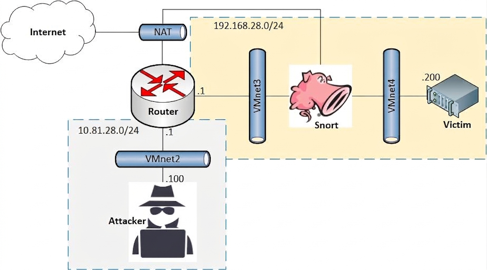

# Snort Network Intrusion Prevention System


## Overview

This project demonstrates the deployment of an inline Intrusion Prevention System (IPS) using Snort.

The environment simulates real-world attack scenarios and focuses on developing custom detection and prevention rules to identify and block malicious network activities.

## Objectives

* Deploy Snort in inline IPS mode
* Analyze network attack traffic
* Develop custom Snort rules
* Prevent exploitation attempts
* Evaluate IPS effectiveness through security testing

## Repository Structure

```text
snort-ips-lab/
│
├── img/
│   └── topology.png 
│
├── LICENSE
│
├── README.md
│
└── Report.pdf

```

### Network Topology



## Technologies Used

* Snort IPS
* Kali Linux
* Metasploit Framework
* Nmap
* Wireshark
* Ubuntu Server
* VMware Workstation

## Security Controls Implemented

### Nmap OS Fingerprinting Detection

Created custom Snort rules to detect and block operating system fingerprinting attempts.

### PHP CGI Argument Injection Prevention

Developed signatures to identify exploit traffic targeting vulnerable PHP CGI implementations.

### UnrealIRCd Backdoor Exploitation Prevention

Implemented rules to detect and prevent exploitation attempts against UnrealIRCd 3.2.8.1 backdoor vulnerabilities.

## Testing Methodology

### Baseline Testing

* Execute attacks without IPS rules
* Capture network traffic
* Analyze attack behavior

### Protection Testing

* Deploy custom Snort rules
* Repeat attacks
* Verify detection and blocking actions

## Results

| Attack              | Detection | Prevention |
| ------------------- | --------- | ---------- |
| Nmap OS Scan        | Yes       | Yes        |
| PHP CGI Injection   | Yes       | Yes        |
| UnrealIRCd Backdoor | Yes       | Yes        |

## Key Findings

* Signature-based IPS can effectively block known attack patterns.
* Rule tuning is necessary to minimize false positives.
* Inline deployment provides immediate protection against network-based attacks.

## Skills Demonstrated

* Intrusion Detection Systems (IDS)
* Intrusion Prevention Systems (IPS)
* Snort Rule Development
* Packet Analysis
* Network Security
* Attack Simulation
* Security Testing
